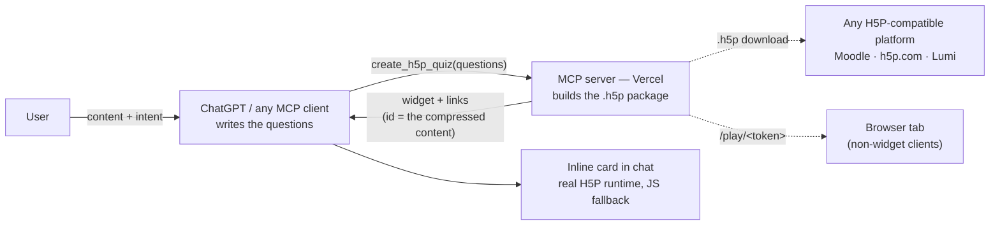

# Interactify

**An H5P AI capability layer, exposed over MCP.** Any AI assistant a teacher, course
creator, or L&D team already uses — ChatGPT first, Claude and other MCP clients next —
turns learning content into an interactive H5P activity, refined by chatting, exported as
a standard, portable `.h5p` file. Live at **[project2608b.vercel.app](https://project2608b.vercel.app)**
· MCP endpoint: `/api/mcp`.

This document is the product spec: why this exists, what it's worth to whom, what's been
built, what's still unresolved, and the engineering decisions behind it.

---

## Why / the problem

Teachers, course creators, and L&D teams already draft content with AI — lesson notes,
explanations, study material. But turning that content into something a learner can
*interact with* — a quiz, a check for understanding — still means leaving the conversation
and going through a separate H5P authoring tool: a new UI to learn, fields to fill in by
hand, no memory of what was just discussed.

The AI already understood the content well enough to explain it. It's a short hop from
there to also being able to *build the activity* — if that capability is put directly where
the content was drafted, instead of behind a separate destination app.

## Value for the user

- **No context switch.** The activity is built and refined inside the same AI conversation
  the content came from — not a second tool with its own login and learning curve.
- **Conversational refinement.** "Make question 2 harder," "add one about transpiration" —
  edits are instructions, not form fields.
- **Review before you use it.** The default view is the answer key, not a live quiz — the
  human checks the AI's work before anyone takes it. (This is a deliberate autonomy choice;
  see [System design decisions](#system-design-decisions-taken).)
- **No lock-in.** The output is a real, standard `.h5p` file. It plays in Moodle, Canvas,
  WordPress, h5p.com, Lumi — anywhere H5P already runs. Nothing about using this ties a
  teacher to a platform they'd have to trust long-term.

## Value for the business

Honestly: **this is the least settled part of the spec, on purpose.** The technical bet
(can AI reliably generate a valid, portable H5P package?) is proven. The commercial bet is
not, and shouldn't be assumed — see [Open questions](#open-questions) for why. What's true
today:

- It's a genuine **distribution bet**: meet users inside an AI assistant they've already
  adopted, rather than building another destination app competing for a new habit.
  MCP-based tool usage from ChatGPT is growing fast this year — the surface itself is a
  tailwind, independent of this specific product's traction.
- Because the underlying capability is a standard MCP server, it isn't locked to one AI
  vendor's roadmap or pricing — ChatGPT today, any MCP-speaking assistant tomorrow.
- Longer-term monetizable shapes exist as **candidate hypotheses, not conclusions**: a
  living/versioned activity (vs. a dead file), usage/xAPI analytics, a validity or
  accessibility guarantee only a vendor can credibly make, or the capability layer itself
  being the product (seat- or generation-based). All four need real user interviews before
  any one of them becomes a plan.

## Why now

- **The blocking technical unknown is resolved.** Whether an AI-authored `.h5p` package
  could even be built and would actually play was the top feasibility risk at the start of
  this build; it's now proven — structurally validated, and confirmed playing in a real
  client (Claude Desktop), not just in our own player.
- **The distribution surface is new and moving fast.** ChatGPT's Apps SDK (inline,
  interactive components inside a chat) and the wider MCP ecosystem are both early-stage in
  2026 — building here now is a first-mover position in an emerging surface, not a bet on
  mature, saturated infrastructure.
- **The gap is now a daily-use gap, not a hypothetical one.** AI-drafted content is already
  how many teachers and creators start; the "now go rebuild this in another tool" step is a
  live friction point, not a speculative one.

## Scope

**Crawl (this version) — in scope:**

- One activity type: **H5P Question Set**, built from multiple-choice questions
  (single- or multi-correct, optional per-answer feedback, configurable pass mark).
- A standard MCP server (`/api/mcp`) exposing `create_h5p_quiz` — works from ChatGPT,
  Claude Desktop, Claude Code, or any MCP client, not just one platform.
- An inline, interactive preview card in ChatGPT (Apps SDK), rendering the **real** H5P
  runtime where the platform allows it, falling back to a matching lightweight version
  where it doesn't.
- A full-page browser player (`/play/<token>`) for clients without inline rendering.
- A downloadable, standards-valid `.h5p` file, importable into any H5P-compatible platform.
- Conversational refinement — re-describe what should change; the activity rebuilds.

**Explicitly out of scope (deferred, not forgotten):**

- Any activity type beyond Question Set (drag-and-drop, flashcards, etc.).
- Listing in the ChatGPT app directory / formal app review.
- Accounts, saved-quiz libraries, usage limits — see [Risks](#risks) on what this trades away.
- Hand-editing individual H5P fields, or importing an existing `.h5p` to modify.
- Any "publish back to a hosted platform" round-trip — gated on the business-model question above.

## Implementation

| Piece | What it does |
|---|---|
| **MCP server** (`app/api/[transport]/route.ts`) | Registers one tool, `create_h5p_quiz`, and the inline widget resource. Runs on Vercel (Next.js). |
| **Package builder** (`lib/h5p/buildQuiz.ts`) | Turns a question list into a valid H5P package, using the official H5P Hub runtime-library bundle (vendored, full dependency closure). |
| **Stateless token** (`lib/h5p/pack.ts`) | A quiz's "id" is its own content — gzip + base64url of the question list. No database; any server instance rebuilds the same file from the link alone. |
| **Inline widget** (`lib/h5p/widget.ts`) | The card ChatGPT renders in the chat. Attempts the real `h5p-standalone` player first; falls back to a hand-built, H5P-styled runner if the platform's sandbox blocks it. Always shows the answer key by default. |
| **Browser player** (`app/play/[token]/page.tsx`) | Full-page interactive fallback for clients (e.g. Claude Desktop) that don't render inline widgets. |
| **File endpoints** (`app/api/h5p/...`) | Serve the `.h5p` download and the unpacked files the live player streams. |

No backend LLM, no database, no accounts — see [System design decisions](#system-design-decisions-taken)
for why each of those is a deliberate choice, not a gap.

**Validated so far:** structurally valid `.h5p` output; real end-to-end run in Claude
Desktop (tool call → download → the file actually plays); real end-to-end run in ChatGPT
(inline card renders, real H5P runtime loads inside the chat card on repeat use, edits
correctly invalidate stale renders). **Not yet validated:** a generated file imported into
h5p.com or Lumi specifically (structural validity confirmed; that specific round-trip isn't).

## Risks

1. **The core business-model question is unresolved.** `.h5p` is an open format — once an
   AI can generate a valid one, there's no inherent reason to pay a vendor to host it. This
   is the single biggest risk to durable value capture, and it's a research question, not
   an engineering one.
2. **Built on an early, evolving platform surface.** ChatGPT's Apps SDK behavior has changed
   under us multiple times already this build (default embed mode, per-URI widget caching,
   undocumented state-persistence across renders) — features that work today could change
   without notice, since we're building against a fast-moving, early-stage surface.
3. **One content type validated.** The "any content → the right interactive format"
   value proposition is proven for multiple-choice only; broader claims are unproven.
4. **No real-user validation yet.** Whether the conversational handoff is actually valuable
   enough to change behavior — versus just being technically possible — hasn't been tested
   outside the build team.
5. **No accounts or persistence, by design (see below) — but that means no usage signal.**
   We can't yet see how many people try this, return to it, or where they drop off.
6. **Output quality has no ceiling or floor of our own.** Question quality rides entirely on
   whichever AI assistant the user brings; that's a feature (no model to maintain) and a
   risk (no ability to guarantee a baseline).

## Open questions

- Is the underlying pain — AI content, then a separate authoring tool — actually painful
  enough to change behavior? Needs real users, not internal conviction.
- What's the real reason to choose a hosted vendor once AI can generate valid, portable
  files directly? (Candidates: a living/versioned activity, analytics, a credibility
  guarantee, or the capability layer as the product itself — untested.)
- Does the real-H5P-in-card experience hold up broadly, or does the JS-lookalike fallback
  show up often enough in practice to undercut the "real activity" promise?
- When more content types are added, should the assistant recommend a type on its own, or
  should scope stay narrow (one type) until Crawl is validated? (Discussed, not decided.)
- Git → Vercel continuous deployment is pushed but not yet linked (pending a one-time
  GitHub App authorization) — CLI-based deploys are the working path until then.

## System design decisions taken

- **No backend AI.** The connected assistant (ChatGPT, Claude, …) authors the questions;
  this server only builds the package. No API key, no inference cost, no quality ceiling
  that's ours to own.
- **No database.** A quiz's identity *is* its content — a compressed, self-describing link.
  Any server instance decodes it back into the same file, forever, with nothing to host or
  lose. This also means editing a quiz never destroys the old version: its link still works.
- **MCP first, not a ChatGPT-only integration.** The same server works from any MCP client.
  ChatGPT is the first and richest surface, not the only one — a deliberate hedge against
  platform dependency.
- **Attempt the real H5P runtime; never let it break the card.** The widget tries to mount
  the actual `h5p-standalone` player (using `embedType: "div"` to work inside ChatGPT's
  no-iframe component sandbox); on any failure it falls back to a lookalike runner built
  from H5P's own styling, so the experience degrades gracefully instead of breaking.
- **Review-and-approve by default.** The card shows the answer key first, not a live quiz —
  matching the chosen autonomy level: the assistant produces a complete draft, a human
  reviews before it's used.
- **One content type, deliberately.** Question Set only, to prove the end-to-end mechanism
  (content → activity → refine → export) before expanding breadth.

### Architecture (suggested reading, not required)



The request crosses into the backend once, as a finished question list, and crosses back
twice — once as the widget itself, once as the live H5P files it loads. Nothing in the
middle is stored anywhere; the link the backend hands back *is* the quiz.

---

## For developers

### Run locally

```bash
npm install
cp .env.example .env        # add your OPENAI_API_KEY for the demo page
npm run dev                 # http://localhost:3000
```

- Demo page: <http://localhost:3000>
- MCP endpoint: `http://localhost:3000/api/mcp`

### Try the MCP server in an AI client

```bash
npx @modelcontextprotocol/inspector
# connect to http://localhost:3000/api/mcp (Streamable HTTP), call create_h5p_quiz
```

To connect it to **Claude Code, Claude Desktop, or ChatGPT Plus** (plans + exact steps):
see [`docs/testing-in-ai-clients.md`](docs/testing-in-ai-clients.md).

### Scripts

- `npm run h5p:libraries` — refresh the vendored H5P runtime libraries from the H5P Hub
- `npm run h5p:smoke` — build a sample quiz and structurally validate the `.h5p`

### Deploy

Hosted on Vercel (`project2608b`). `OPENAI_API_KEY` is a project env var (demo page only —
the MCP path needs no key). Full milestone history: [`docs/mvp-log.md`](docs/mvp-log.md).
