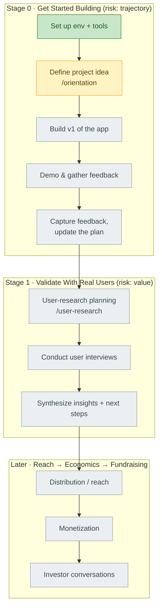

# Project Journey — project2608b

> Living map of how this project gets built. **The spine is the Sherpa-B workflow.**
> This file stays lean and is updated at each milestone. The verbatim question/answer
> transcript lives in [[journey-log]] (append-only).

---

## Where I am now

| | |
|---|---|
| **Stage** | 0 — Get Started Building |
| **Last milestone** | Sherpa-B connected & project bound — 2026-09-08 |
| **Next action** | `/sherpa-b:orientation` — finish build-env setup + define the project idea |
| **Project idea** | _not yet defined_ |
| **Open risks in focus** | trajectory (Stage 0), then value (Stage 1) |

---

## The workflow (spine)

Legend: 🟩 done · 🟨 current · ⬜ not started

---

## Stages

### Stage 0 — Get Started Building  🟨 in progress

**Objective:** Stand up the build environment and the program assistant, then lock in a
concrete project idea and ship a first version to react to.

**Risk dimension:** trajectory (are we set up to move at all?)

**Milestones**
- [x] **Sherpa-B project initialized & bound** — 2026-09-08
- [ ] Build environment + tooling finished, project idea defined (`/orientation`)
- [ ] First version of the app built
- [ ] App demoed, cohort feedback gathered
- [ ] Feedback captured, plan updated

**Key decisions**

| Date | Decision | Rationale | Alternatives considered |
|---|---|---|---|
| 2026-09-08 | Project name `project2608b`, bound to git root commit `a763e55` | project-init anchors the Sherpa-B project to the repo's git identity; folder name is the default | — |
| 2026-09-08 | Keep the journey record as two files: `journey.md` (lean spine) + `journey-log.md` (append-only transcript) | Keeps per-turn token/latency cost low; the big log is only ever appended to, never re-read wholesale | Single file (rejected: grows unbounded, re-read every update) |
| 2026-09-08 | Visuals via Mermaid embedded in markdown | Renders free in GitHub / Obsidian / VS Code; diagram is plain text, cheap to edit one node at a time | Obsidian Canvas (rejected: manual upkeep, more tokens) |

**Learnings & concepts**
- **Sherpa-B** = agentic innovation-management platform. Drives a project from idea → build → reach/distribution → monetization → fundraising, via tasks with step-by-step instructions plus a telemetry layer that tracks progress over time.
- **Six risk dimensions** every innovation project manages: `value`, `engineering`, `trust`, `trajectory`, `economics`, `distribution`. Each Block targets one.
- **Structure:** work is grouped into **Blocks**, each holding ordered **Tasks**. Order is topological (`do_before` / `do_after`), tie-broken by importance/effort.
- **Task modes:** `guided` (a structured `/`-command workout) vs `freestyle` (do it your way).
- **Gating:** later Blocks unlock on progress (e.g. Stage 1 needs 50% of Stage 0 done).

---

### Stage 1 — Validate Your Idea With Real Users  🔒 locked (needs 50% of Stage 0)

**Objective:** Put the build in front of real users and pressure-test whether it delivers value.

**Risk dimension:** value

**Milestones**
- [ ] User-research planning workout (`/user-research`)
- [ ] Conduct user interviews to validate quality risk
- [ ] Synthesize research insights + decide next steps

_Decisions / learnings: to be filled in when this stage opens._

---

### Stage 2+ — Reach, Economics, Fundraising  ⬜ not yet scoped

Distribution/reach → monetization → investor conversations. Details load from Sherpa-B as
earlier stages complete.

---

## Running summary

**2026-09-08 —** Session started on an empty repo with one commit. Connected Sherpa-B
(`/sherpa-b:project-init` → *created*), which minted project `project2608b` and bound it to
the repo. Marked the setup task done. Set up this journey record. Next step is `/orientation`
to define what we're actually building — the project idea is still open.

---

## Change log

| Date | Change |
|---|---|
| 2026-09-08 | Journey record created; Stage 0 mapped; Sherpa-B connection milestone logged |
| 2026-09-08 | Obsidian vault set to project root; `.gitignore` added; `2608b/` subfolder removed |
