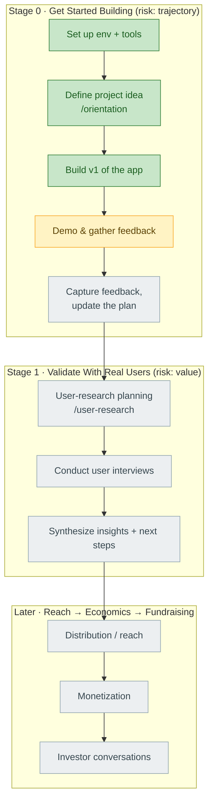

# Project Journey — project2608b

> Living map of how this project gets built. **The spine is the Sherpa-B workflow.**
> This file stays lean and is updated at each milestone. The verbatim question/answer
> transcript lives in [[journey-log]] (append-only).

---

## Where I am now

| | |
|---|---|
| **Stage** | 0 — Get Started Building |
| **Last milestone** | **`mvp-1` tagged** — real H5P runtime confirmed rendering inline in the ChatGPT card (with a graceful lookalike fallback), hardened against two real repeat-use bugs, GitHub repo established (`MVP-1-Interactify`), README rewritten as an executive product spec — 2026-09-11 |
| **Next action** | Scope MVP 2 (candidates: a second H5P content type; the prompt-vs-structured-input branch point discussed and parked). Finish linking Vercel↔GitHub for auto-deploy (blocked on a one-time GitHub App authorization — see Open questions). Still open from Crawl: confirm a `.h5p` imports/plays in h5p.com or Lumi; record the demo. |
| **Project idea** | **H5P AI capability layer (MCP)** — any AI assistant (ChatGPT first, then Claude/other MCP clients) turns content into interactive H5P activities via an MCP server; refine conversationally, export `.h5p`. Same model as Kahoot (ships a ChatGPT App **and** an MCP server). Autonomy: **Level 2 — Collaborator**. |
| **Goal** | Crawl→Walk→Run. Crawl = launchable MVP this week. Program ends **Sep 18, 2026**. |
| **Open risks in focus** | trajectory (Stage 0), then value (Stage 1) |

---

## The workflow (spine)

Legend: 🟩 done · 🟨 current · ⬜ not started

---

## Stages

### Stage 0 — Get Started Building  🟨 in progress

**Objective:** Stand up the build environment and the program assistant, then lock in a
concrete project idea and ship a first version to react to.

**Risk dimension:** trajectory (are we set up to move at all?)

**Milestones**
- [x] **Sherpa-B project initialized & bound** — 2026-09-08
- [x] **Orientation complete** — workspace dirs, profile, project idea, autonomy level — 2026-09-08
- [x] **First version built & deployed** — H5P quiz MCP server (ChatGPT-ready) + demo harness, live on Vercel — 2026-09-08
- [x] **MVP 1 (Claude Desktop)** — tool connected to Claude Desktop, generated a 7-question quiz end to end — 2026-09-09
- [x] **MVP 1.1 (Claude Desktop)** — `/play/<token>` browser-playable link — **works**; quiz plays, so the `.h5p` is confirmed to play (not just structurally valid) — 2026-09-09
- [x] **MVP 1.2 (Claude Desktop)** — inline MCP-UI resource — **Claude Desktop does not render it**; inline experience comes from ChatGPT instead — 2026-09-09
- [x] **MVP 1 (ChatGPT)** — connector added (in the **Work/Business workspace**); ChatGPT calls the tool and **renders the inline card** (answer key + Play/Download) — 2026-09-09
- [x] **MVP 1.1 (ChatGPT)** — "▶ Take the quiz" in the card: a self-contained JS quiz runner (answer/check/score) — the skybridge sandbox blocks embedding the real H5P runtime (external script AND iframe), so this mirrors Kahoot's self-contained inline preview — 2026-09-09
- [x] **MVP 1.2 (ChatGPT)** — in-card quiz restyled against H5P's own CSS so it reads as a real H5P Question Set (progress dots, pill options in H5P colours, score bar + star, H5P footer) — 2026-09-09
- [x] **MVP 1.3 (ChatGPT)** — real H5P runtime in the card, confirmed working. Root-caused B2's hang (h5p-standalone defaults to iframe embed → ChatGPT's `frame-src 'none'` blocks it); fixed with `embedType:"div"` + `resource_domains`/CORS from our origin. Confirmed live in ChatGPT — 2026-09-10/11
- [x] **Real-H5P hardening (quiz-v7 → v9)** — three repeat-use bugs found via live testing and fixed: (1) mount point had to be attached to the document before `H5P.init()` runs, plus richer fallback diagnostics; (2) clicking "Take the quiz" a second time re-mounted from scratch and silently failed (h5p-standalone's globals aren't fully reset) — fixed by reusing the mounted instance instead; (3) that same reuse kept showing *stale* content after a conversational edit — fixed by invalidating the cached instance whenever the underlying quiz token changes — 2026-09-11
- [x] **GitHub repo established** — `github.com/ngupta1729/MVP-1-Interactify`, full history pushed — 2026-09-11
- [x] **README rewritten as an executive-facing product spec** — problem/value/why-now/scope/risks/open-questions/design-decisions + a Mermaid architecture diagram — 2026-09-11
- [x] **`mvp-1` tagged** — decision: keep one repo/folder through MVP2+ (branches for risky work, tags for milestone boundaries) rather than forking per milestone — 2026-09-11
  - remaining: confirm `.h5p` imports into h5p.com/Lumi · finish Vercel↔GitHub auto-deploy link · record demo
  - full log: `docs/mvp-log.md` (Track A = Claude Desktop, Track B = ChatGPT)
- [ ] App demoed, cohort feedback gathered
- [ ] Feedback captured, plan updated

**Key decisions**

| Date | Decision | Rationale | Alternatives considered |
|---|---|---|---|
| 2026-09-08 | Project name `project2608b`, bound to git root commit `a763e55` | project-init anchors the Sherpa-B project to the repo's git identity; folder name is the default | — |
| 2026-09-08 | Journey record as two files: `journey.md` (lean spine) + `journey-log.md` (append-only transcript) | Keeps per-turn token/latency cost low; the big log is only ever appended to | Single file (rejected: grows unbounded) |
| 2026-09-08 | Visuals via Mermaid in markdown; Obsidian vault = project root | Renders free in Obsidian/GitHub; plain text, cheap to edit | Obsidian Canvas (rejected: manual upkeep) |
| 2026-09-08 | **Project pivot:** H5P ChatGPT App (was: `project2608a` predictive-maintenance copilot) | New repo, fresh idea the participant is excited to build hands-on | — |
| 2026-09-08 | **Build as a ChatGPT App** (Kahoot-style), not a standalone tool on the raw OpenAI API | ChatGPT supplies AI + intent; H5P app is the tool layer. Matches the reference model | Standalone OpenAI-API tool |
| 2026-09-08 | **Starting autonomy = Level 2, Collaborator** | App drafts a full activity; human reviews/approves before use. A floor to level up from, not a ceiling | L1 Assistant · L3 Agent |
| 2026-09-08 | **Crawl = launchable MVP**, binge this week | ~10 days to final demo (Sep 18); prove the core handoff fast, then get real feedback | Full multi-feature build (deferred to Walk/Run) |
| 2026-09-08 | Telemetry backup mode: `backup_full_observation_log`; applied settings permission allowlist | Fuller mentor visibility; fewer permission prompts during workouts | progress-only mode |
| 2026-09-08 | **First version = one activity type: H5P Question Set (multiple choice)** | Most recognizable "interactive activity", maps cleanly from notes, best-documented H5P format | Flashcards · Fill-in-the-Blanks · Interactive Summary |
| 2026-09-08 | **Build as a real MCP server** (`/api/mcp`), + a demo harness that fakes the ChatGPT side | It *is* the product; participant has no paid ChatGPT dev-mode account, so the harness (direct OpenAI call) makes it demoable now | Local-only prototype · CLI |
| 2026-09-08 | **No LLM / API key in the app itself** — ChatGPT is the model, it calls the tool with structured questions | The defining property of the ChatGPT App model; cheaper, simpler, no per-use AI cost | Standalone tool calling OpenAI directly |
| 2026-09-08 | **`.h5p` built from the official H5P Hub bundle**, runtime libs vendored (`lib/h5p/vendor`) | Directly de-risks the #1 quality risk (valid `.h5p`); guaranteed-correct library set + versions | Hand-write `h5p.json` deps (fragile) · library-light package (import-only) |
| 2026-09-08 | **Stateless: a quiz's id = gzip+base64url of its `QuizSpec`** | Rebuilds on any Vercel instance; no DB / blob store to set up during a binge | In-memory Map (breaks across lambdas) · Vercel Blob (setup overhead) |
| 2026-09-08 | Deploy target: **Vercel** (`project2608b.vercel.app`), production, no deployment protection | Public HTTPS URL needed for an MCP server; participant chose Vercel; CLI already authed | Self-host · ngrok tunnel |
| 2026-09-08 | **Reframe: the product is H5P's AI capability layer over MCP**, not "an H5P ChatGPT App". ChatGPT is the first interface; Claude + other MCP clients next. | Kahoot ships both a ChatGPT App and an MCP server; OpenAI's Apps SDK is MCP-based and portable; a capability layer is bigger and more defensible than a single-platform plugin. Costs ~nothing — the v1 server already is a standard MCP server; the ChatGPT bits are additive `_meta` + a `ui://` component. | Stay "ChatGPT App" only |
| 2026-09-11 | **One repo, one project folder, through MVP2 and beyond** — not a new repo per milestone | Vercel URL / ChatGPT connector / GitHub App auth / journey record all key off this repo's identity; a new repo repeats that setup cost for no benefit. Git already solves "isolate risky work" via branches, and "mark a boundary" via tags | New repo per MVP (rejected — fragments history and deployment identity) |
| 2026-09-08 | Studied the **Kahoot ChatGPT app** (support docs) as the reference UX. Confirms: draft-first (create/update only), ≤20 questions/prompt, inline preview, NL edits, ~2 question types, and a **button that opens the draft back in the platform**. Kahoot monetizes save/host (free tier = 5 questions), not generation. | Best concrete validation of the model. Surfaces our v1 UX gap (manual `.h5p` download vs. one-click "open in [platform]") **and** the open monetisation/incentive question — Kahoot's format is proprietary so its host lock-in works; `.h5p` is open, so neither the gap's value nor the incentive is proven yet. Both → Stage 1 user research. | — |

**Learnings & concepts**
- **Sherpa-B** = agentic innovation-management platform. Idea → build → reach → monetize → fundraise, via guided/freestyle tasks + a telemetry layer.
- **Six risk dimensions:** `value`, `engineering`, `trust`, `trajectory`, `economics`, `distribution`. Each Block targets one.
- **Structure:** **Blocks** hold ordered **Tasks** (topological `do_before`/`do_after`). `guided` tasks run as **workouts** with an Acquire→Shape→Deliver loop per state.
- **Persistence model:** workouts write **structured log entries** (`shb_telemetry.track_event log_entry`, typed: decision/fact/preference/constraint/contract) + **prose docs** in `reports/`. Server profile holds project fields. Don't duplicate between them.
- **Autonomy spectrum:** L1 Assistant (AI does legwork, human executes) · L2 Collaborator (AI drafts, human approves) · L3 Agent (AI decides within bounds, human reviews exceptions). Start low, level up as trust builds.
- **H5P** = open framework for interactive HTML5 learning content (quizzes, interactive video, drag-and-drop, branching). Output is a `.h5p` package.
- **Program reality:** 2608 is a **4-week** program (not 7). Final Demo **Sep 18, 2026** — ~10 days out as of orientation.

**Open questions / risks**
- Is the "content → interactive activity" handoff a real pain worth solving? (value risk — Stage 1; this is the primary thing the first demo asks the cohort)
- ~~Feasibility of generating a valid `.h5p`~~ — addressed: builder produces a structurally
  valid Question Set from the official Hub bundle. Still to confirm by real import into
  h5p.com / Lumi.
- ChatGPT App integration not yet tested inside ChatGPT (no paid dev-mode account) — the MCP
  server is real and Inspector-tested; ChatGPT-side is narrated/recorded for now.
- **Monetisation / incentive:** once AI generates a portable `.h5p`, what makes a user pay
  for (or return to) the vendor's product? Hosting isn't a moat — open format. Candidates:
  living edit/track loop, xAPI analytics, a validity/accessibility guarantee, or selling the
  capability layer directly. Stage 1 user-research question — see `reports/builder_priorities.md`.
- No users lined up yet for the Final Demo test.
- Vercel↔GitHub auto-deploy not yet linked — `vercel git connect` fails until the
  participant grants Vercel's GitHub App access to the new repo (one-time, browser-side;
  can't be done from the CLI). CLI deploys (`vercel deploy --prod`) work fine meanwhile.
- Telemetry backup can't reach the server: "no sherpa-b MCP credentials found" — events log locally only. Consider `/shb-doctor`.

---

### Stage 1 — Validate Your Idea With Real Users  🔒 locked (needs 50% of Stage 0)

**Objective:** Put the build in front of real users and pressure-test whether it delivers value.

**Risk dimension:** value

**Milestones**
- [ ] User-research planning workout (`/user-research`)
- [ ] Conduct user interviews to validate quality risk
- [ ] Synthesize research insights + decide next steps

_Decisions / learnings: to be filled in when this stage opens._

---

### Stage 2+ — Reach, Economics, Fundraising  ⬜ not yet scoped

Distribution/reach → monetization → investor conversations. Details load from Sherpa-B as
earlier stages complete.

---

## Running summary

**2026-09-11 —** Closed out Crawl / **tagged `mvp-1`**. Confirmed the real H5P runtime
renders inline in the ChatGPT card (B4, quiz-v5) — then live testing surfaced and fixed three
real bugs on repeat use: the mount point wasn't attached to the document when `H5P.init()`
ran (plus added fallback diagnostics so the next failure is self-explanatory); a second
"Take the quiz" click re-mounted from scratch and silently failed because h5p-standalone
doesn't fully reset its own globals — fixed by reusing the working instance instead of
remounting (quiz-v7/v8); that same reuse then kept showing *stale* content after a
conversational edit — fixed by invalidating the cached instance whenever the quiz's content
token changes (quiz-v9). Separately: discussed how ChatGPT decides which tool/content-type
to use (it's entirely the model's call, driven by tool description + schema — no MCP
mechanism exists for a plugin to dictate ordering or defaults), which shaped a decision for
the next content-type addition (Option B: one tool with a required, description-guided
`type` field, no hardcoded default) and surfaced a richer "ask how the user wants to start"
UX idea that was deliberately **parked**, not built, to protect Crawl scope.

Established the repo on **GitHub** (`ngupta1729/MVP-1-Interactify`, full history pushed) and
rewrote `README.md` as an **executive-facing product spec** (why/problem, value for user,
value for business — explicitly flagged unresolved — why now, scope, implementation, risks,
open questions, design decisions, a Mermaid architecture diagram). Vercel↔GitHub auto-deploy
is pushed but not yet linked — blocked on a one-time GitHub App authorization the participant
still needs to grant; CLI deploys remain the working path until then.

Asked whether MVP 2 should get its own repo/project folder — **decided no**: this repo's
identity is load-bearing (production URL, the ChatGPT connector, GitHub App auth, the journey
record itself), so a fork repeats that setup cost for zero benefit. Instead: branch for
risky/sizeable MVP2 work, tag milestone boundaries (`mvp-1` done today) — git already solves
what a new repo was being reached for.

**2026-09-08 (build) —** Built and deployed the **first version**: a standard MCP server at
`/api/mcp` with one tool, `create_h5p_quiz`, that turns a structured question list (which the
AI assistant writes from the user's content) into a valid, self-contained `.h5p` **Question
Set** and returns a download link — plus an inline preview when the client is ChatGPT. Any
MCP client can connect. Because the participant has no paid ChatGPT developer-mode account,
there's also a **demo harness** (`/` + `/api/demo`) that uses a direct OpenAI call in place
of the assistant, with a live embedded H5P player and a
conversational refine loop. The `.h5p` builder stitches generated JSON into the official H5P
Hub library bundle (vendored), and the whole app is stateless — a quiz's id *is* its
compressed spec, so it rebuilds on any serverless instance. Verified end-to-end locally and
on the deployed URL (`https://project2608b.vercel.app`). Remaining before the cohort demo:
set `OPENAI_API_KEY` on Vercel, confirm a generated `.h5p` plays in h5p.com / Lumi, record
the walkthrough.

Later that day, **reframed the product**: it's H5P's *AI capability layer over MCP*, with
ChatGPT as the first interface (Claude and other MCP clients next) — not "an H5P ChatGPT
App". The v1 code already is exactly this; the change is positioning + roadmap. Studied the
**Kahoot ChatGPT app** as the reference UX (they run the same dual model — a ChatGPT App
*and* an MCP server): it's draft-first, ≤20 questions/prompt, inline preview, natural-language
edits, ~2 question types, and a button that opens the draft back in Kahoot; Kahoot monetizes
saving/hosting, not generation. The one UX gap in our v1 vs. Kahoot: we hand back a `.h5p`
file to import by hand, rather than a one-click "open in \[platform\]". Closing that round-trip
is a **candidate** for Walk — but the participant flagged that, unlike Kahoot's proprietary
format, `.h5p` is open, so "come back to h5p.com" isn't a moat and it's not yet clear what the
real vendor incentive is. Both — does the round-trip loop matter to teachers, and what is the
incentive — are Stage 1 user-research questions (see `reports/builder_priorities.md`).

**2026-09-09 —** First real-client validation. Connected the deployed MCP server to **Claude
Desktop** as a custom connector (Claude Pro) and generated a 7-question water-cycle quiz end
to end, with the refine loop — **MVP 1 (Claude Desktop)**. Confirmed "any MCP client, not
just ChatGPT" is real, and the questions the assistant writes from source content are good.
Claude Desktop shows the tool result + a download link but **no inline preview** (our widget
is ChatGPT-only `+skybridge`). Added two increments: **MVP 1.1** — the tool returns a
`/play/<token>` link that opens the quiz fully interactive in a browser tab (new
`app/play/[token]` page + shared `components/H5pPlayer`); **MVP 1.2** — the tool also returns
an MCP-UI resource (`ui://h5p-quiz/<token>`, HTML iframing the play page) so MCP-UI-capable
clients can render the quiz inline. Tested from Claude Desktop: **MVP 1.1 works** — the Play
link opens the quiz and it plays (which also confirms the generated `.h5p` genuinely plays,
not just validates structurally). **MVP 1.2 does not** — Claude Desktop doesn't render
tool-result UI resources inline; the resource is left in the response for other clients, and
the real inline experience will come from ChatGPT's skybridge widget. So the current picture:
Claude = link-based, ChatGPT = inline card.

Then got the connector working in **ChatGPT** (it was available in the **Work/Business
workspace**, not personal Plus) — **MVP 1 (ChatGPT)**: ChatGPT calls `create_h5p_quiz` and
**renders our inline widget** (an answer-key preview + ▶ Play / Download buttons). The thing
Claude Desktop couldn't do. Built **MVP 1.1 (ChatGPT)** on top: a "▶ Play here" toggle that
embeds the real `h5p-standalone` player *inside* the card (with `openai/widgetCSP` +
cross-origin CORS so it loads from our domain). Deployed; awaiting an in-ChatGPT test. The
milestone log now runs two tracks — `docs/mvp-log.md` Track A (Claude Desktop) / Track B
(ChatGPT).

**2026-09-08 (orientation) —** Started on an empty repo. Connected Sherpa-B (`project-init` → *created*),
project `project2608b` bound to the repo. Set up the journey record (two files, Mermaid spine)
and an Obsidian vault at the project root. Ran the **Orientation** workout end to end:
created the workspace dirs, seeded `.claude/settings.json` + `CLAUDE.md`, and built out the
participant profile. Landed on the project: an **H5P ChatGPT App** (a deliberate pivot from
the earlier predictive-maintenance idea) — go from AI content/conversation in ChatGPT straight
to a refinable interactive H5P activity, built as a Kahoot-style ChatGPT App, at **autonomy
Level 2 (Collaborator)**. Goal is a **launchable Crawl MVP this week** (final demo Sep 18).
Committed as `0bd4f47`. Next: `/coach`, then start building the first version via Ideation.

---

## Change log

| Date | Change |
|---|---|
| 2026-09-08 | Journey record created; Stage 0 mapped; Sherpa-B connection milestone logged |
| 2026-09-08 | Obsidian vault set to project root; `.gitignore` added; `2608b/` subfolder removed |
| 2026-09-08 | Orientation workout complete: workspace, profile, project idea (H5P ChatGPT App), Level 2 autonomy, Crawl MVP goal. Commit `0bd4f47`. |
| 2026-09-08 | First version built: Next.js app at repo root — MCP server (`create_h5p_quiz`) + demo harness + `.h5p` Question Set builder. Deployed to `project2608b.vercel.app`. `specs/mvi_spec.md` added. |
| 2026-09-08 | Product reframed to "H5P AI capability layer (MCP), ChatGPT first"; `specs/mvi_spec.md`, `journey.md`, `README.md` updated. Kahoot ChatGPT app studied as reference UX. |
| 2026-09-09 | MVP 1 validated in **Claude Desktop** (custom connector, 7-question quiz E2E). Added MVP 1.1 (`/play/<token>` browser preview link) + MVP 1.2 (inline MCP-UI resource — Claude doesn't render it). `docs/mvp-log.md` started. |
| 2026-09-09 | **MVP 1 (ChatGPT)** — connector working in the Work/Business workspace; ChatGPT renders the inline widget. **MVP 1.1 (ChatGPT)** — "▶ Play here" embeds the interactive player in the card (`openai/widgetCSP` + CORS); deployed. `docs/mvp-log.md` split into Track A / Track B. |
| 2026-09-10/11 | Real H5P runtime confirmed rendering in the ChatGPT card (B4, `embedType:"div"`); three repeat-use bugs found live and fixed (mount-timing/diagnostics, reuse-instead-of-remount, stale-content-on-edit invalidation) across `quiz-v5` → `quiz-v9`. |
| 2026-09-11 | GitHub repo `ngupta1729/MVP-1-Interactify` created, full history pushed. `README.md` rewritten as an executive product spec. Decided: one repo/folder through MVP2+ (branches + tags, not forks). Tagged `mvp-1`. |
