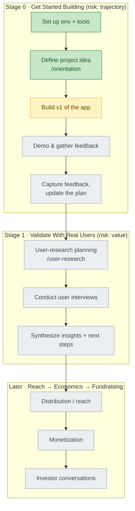

# Project Journey — project2608b

> Living map of how this project gets built. **The spine is the Sherpa-B workflow.**
> This file stays lean and is updated at each milestone. The verbatim question/answer
> transcript lives in [[journey-log]] (append-only).

---

## Where I am now

| | |
|---|---|
| **Stage** | 0 — Get Started Building |
| **Last milestone** | Orientation complete — profile, project idea & autonomy level set — 2026-09-08 |
| **Next action** | `/sherpa-b:coach` → then **Build the first version of the app** (Ideation workout for the first feature) |
| **Project idea** | **H5P ChatGPT App** — turn AI content/conversation directly into interactive H5P activities; create, refine conversationally, export `.h5p`. ChatGPT App model (like Kahoot's). Autonomy: **Level 2 — Collaborator**. |
| **Goal** | Crawl→Walk→Run. Crawl = launchable MVP this week. Program ends **Sep 18, 2026**. |
| **Open risks in focus** | trajectory (Stage 0), then value (Stage 1) |

---

## The workflow (spine)

Legend: 🟩 done · 🟨 current · ⬜ not started

---

## Stages

### Stage 0 — Get Started Building  🟨 in progress

**Objective:** Stand up the build environment and the program assistant, then lock in a
concrete project idea and ship a first version to react to.

**Risk dimension:** trajectory (are we set up to move at all?)

**Milestones**
- [x] **Sherpa-B project initialized & bound** — 2026-09-08
- [x] **Orientation complete** — workspace dirs, profile, project idea, autonomy level — 2026-09-08
- [ ] First version of the app built (Crawl MVP)
- [ ] App demoed, cohort feedback gathered
- [ ] Feedback captured, plan updated

**Key decisions**

| Date | Decision | Rationale | Alternatives considered |
|---|---|---|---|
| 2026-09-08 | Project name `project2608b`, bound to git root commit `a763e55` | project-init anchors the Sherpa-B project to the repo's git identity; folder name is the default | — |
| 2026-09-08 | Journey record as two files: `journey.md` (lean spine) + `journey-log.md` (append-only transcript) | Keeps per-turn token/latency cost low; the big log is only ever appended to | Single file (rejected: grows unbounded) |
| 2026-09-08 | Visuals via Mermaid in markdown; Obsidian vault = project root | Renders free in Obsidian/GitHub; plain text, cheap to edit | Obsidian Canvas (rejected: manual upkeep) |
| 2026-09-08 | **Project pivot:** H5P ChatGPT App (was: `project2608a` predictive-maintenance copilot) | New repo, fresh idea the participant is excited to build hands-on | — |
| 2026-09-08 | **Build as a ChatGPT App** (Kahoot-style), not a standalone tool on the raw OpenAI API | ChatGPT supplies AI + intent; H5P app is the tool layer. Matches the reference model | Standalone OpenAI-API tool |
| 2026-09-08 | **Starting autonomy = Level 2, Collaborator** | App drafts a full activity; human reviews/approves before use. A floor to level up from, not a ceiling | L1 Assistant · L3 Agent |
| 2026-09-08 | **Crawl = launchable MVP**, binge this week | ~10 days to final demo (Sep 18); prove the core handoff fast, then get real feedback | Full multi-feature build (deferred to Walk/Run) |
| 2026-09-08 | Telemetry backup mode: `backup_full_observation_log`; applied settings permission allowlist | Fuller mentor visibility; fewer permission prompts during workouts | progress-only mode |

**Learnings & concepts**
- **Sherpa-B** = agentic innovation-management platform. Idea → build → reach → monetize → fundraise, via guided/freestyle tasks + a telemetry layer.
- **Six risk dimensions:** `value`, `engineering`, `trust`, `trajectory`, `economics`, `distribution`. Each Block targets one.
- **Structure:** **Blocks** hold ordered **Tasks** (topological `do_before`/`do_after`). `guided` tasks run as **workouts** with an Acquire→Shape→Deliver loop per state.
- **Persistence model:** workouts write **structured log entries** (`shb_telemetry.track_event log_entry`, typed: decision/fact/preference/constraint/contract) + **prose docs** in `reports/`. Server profile holds project fields. Don't duplicate between them.
- **Autonomy spectrum:** L1 Assistant (AI does legwork, human executes) · L2 Collaborator (AI drafts, human approves) · L3 Agent (AI decides within bounds, human reviews exceptions). Start low, level up as trust builds.
- **H5P** = open framework for interactive HTML5 learning content (quizzes, interactive video, drag-and-drop, branching). Output is a `.h5p` package.
- **Program reality:** 2608 is a **4-week** program (not 7). Final Demo **Sep 18, 2026** — ~10 days out as of orientation.

**Open questions / risks**
- Is the "content → interactive activity" handoff a real pain worth solving? (value risk — Stage 1)
- Feasibility of generating a **valid `.h5p`** package programmatically, and of the ChatGPT App integration — participant is new to both.
- No users lined up yet for the Final Demo test.
- Telemetry backup can't reach the server: "no sherpa-b MCP credentials found" — events log locally only. Consider `/shb-doctor`.

---

### Stage 1 — Validate Your Idea With Real Users  🔒 locked (needs 50% of Stage 0)

**Objective:** Put the build in front of real users and pressure-test whether it delivers value.

**Risk dimension:** value

**Milestones**
- [ ] User-research planning workout (`/user-research`)
- [ ] Conduct user interviews to validate quality risk
- [ ] Synthesize research insights + decide next steps

_Decisions / learnings: to be filled in when this stage opens._

---

### Stage 2+ — Reach, Economics, Fundraising  ⬜ not yet scoped

Distribution/reach → monetization → investor conversations. Details load from Sherpa-B as
earlier stages complete.

---

## Running summary

**2026-09-08 —** Started on an empty repo. Connected Sherpa-B (`project-init` → *created*),
project `project2608b` bound to the repo. Set up the journey record (two files, Mermaid spine)
and an Obsidian vault at the project root. Ran the **Orientation** workout end to end:
created the workspace dirs, seeded `.claude/settings.json` + `CLAUDE.md`, and built out the
participant profile. Landed on the project: an **H5P ChatGPT App** (a deliberate pivot from
the earlier predictive-maintenance idea) — go from AI content/conversation in ChatGPT straight
to a refinable interactive H5P activity, built as a Kahoot-style ChatGPT App, at **autonomy
Level 2 (Collaborator)**. Goal is a **launchable Crawl MVP this week** (final demo Sep 18).
Committed as `0bd4f47`. Next: `/coach`, then start building the first version via Ideation.

---

## Change log

| Date | Change |
|---|---|
| 2026-09-08 | Journey record created; Stage 0 mapped; Sherpa-B connection milestone logged |
| 2026-09-08 | Obsidian vault set to project root; `.gitignore` added; `2608b/` subfolder removed |
| 2026-09-08 | Orientation workout complete: workspace, profile, project idea (H5P ChatGPT App), Level 2 autonomy, Crawl MVP goal. Commit `0bd4f47`. |
